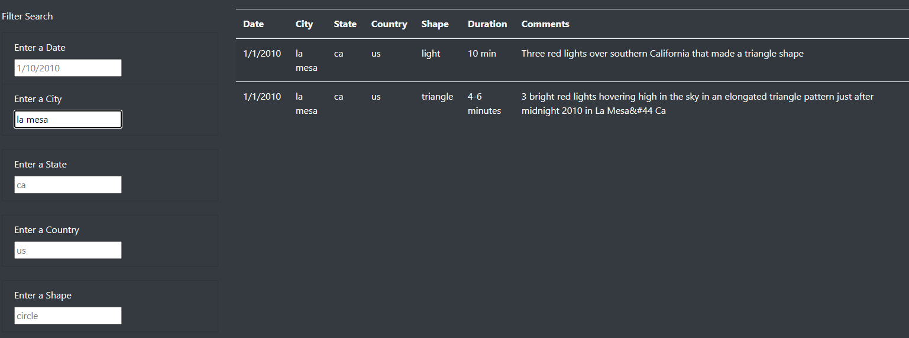
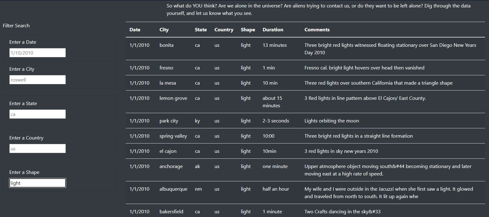
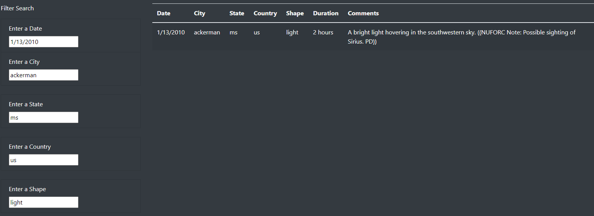

# UFO Sightings: Fact of Fancy?

## Overview of the Analysis

The purpose of this analysis is to begin the journey of learning JavaScript by looking into its technical aspects and how it applies to the field of data analytics and vizualization. In this project I will assist Dana, a data journalist, as she writes an article about her hometown, McMinnville, Oregon. According to Dana her hometown is famous for its UFO sightings that go back to her choldhood during the 1950's. She has decided to use a Javascript data file she received to create a Webpage for her story and to make the data available to others. We will build a dynamic Webpage by inserting JavaScript into an HTML page. It will also be important to draw upon my knowledge of CSS and Boootstrap to build and style the page for consistent functionality. I'll also use ChromeDev tools to test the code created for the Webpage.

Specifically, I am going to create a table to organize UFO data that is stored as a JavaScript array, or list. This table will have the ability to filter data based on certain criteria. The page will display Dana's article and give those who visit her page the opportunity to interact with the data and search for UFO sightings based on defined criteria. This will be a wonderful opportunity to assist Dana in creating a useable tool for those who are interested in searching for UFO sightings that occurred throughout the United States.

## Results 
We've done a lot of work and I truly hope you have enjoyed the process as much as I have. The final phase of our project, Dana, is to make sure you are comfortable using the filtering capability of the Webpage we have created. It has some limitations, but overall it is a great tool for searching the data you provided for the project. 

1.) First, take a look at the three pictures I have provided below. You'll see that there are five criteria proveded for the 'Filter Search': date, city, state, country, and shape. As well, there are potentially seven results for each search: date, city, state, country, shape, duration, and comments. It will be necessary for the user to match one of the five criteria provided with data in our Javascript file in order for a result to be returned.

2.) Second, in order to begin a search of the data, enter a word that describes one of the five 'Filter Search' criteria. For example, if you will notice there are sample words that are 'nested' in the "Filter Search' boxes. Type the appropriate information into one or more of the boxes and then click the enter button on your keyboard to initiate a search. 

3.) Next, it is not necessary to fill in each box in order for information to be returned. You'll see in the first picture below that only the 'Enter a City' box was chosen and information on every event in our data that occurred in that city is returned in the search. The same is true for the second picture that demonstrates what will happen when only a shape is known and nothing else. The result is every event that matches the filter of 'shape' is returned from the data linked to the Webpage. 

4.) And finally, if someone has a specific event in mind and all five of the criteria are chosen, the results are very specific. Pretty cool, huh! I think your idea is great! Thank you for the opportunity to work with someone who knew exactly what we needed to accomplish. 

## Summary
In summary, this analysis is a wonderful starting place for those who may have some familiarity with UFO sightings, but I think you and I can make this tool really amazing with a few additions. Here are a few suggestions that I believe will make your Webpage more appealing:

1.) We are limited to searching the data in our one JavaScript file. What do you think might happen to the "Filter Search' capability if we linked this Webpage to several other Webpages that are dedicated to the same goals you have in mind? I have the knowledge needed to search other UFO Websites and then automatically update your Webpage with new searchable data; it's called 'web scrapping'. The new data would contain most if not all of the search criteria offered on your Webpage and it will be updated as often as you want. You would have the opportunity to share your data with others and they would share their data with you to provide more events for the user to search and learn about UFO sightings.

2.) Currently users are not allowed to add their personal UFO sightings to the Webpage. Perhaps I could create an additional area below the current "Filter Search' to encourage people to share their personal UFO sighting experiences. I have the knowledge to create additional filter boxes (or maybe you would want to try drop-down lists) that would be the same as the seven areas of search results: date, city, state, country, shape, duration, and comments. I believe a few addional boxes would be helpful. Perhpas, their name and contact information would be useful to you for follow up. Once the information is submitted, I would have the information emailed to you (I know how to make that happen, too!) and you could make contact with the person if their story interests you for another article or series of articles, or documentary! 

This was a fun analysis, Dana. It took a lot of hours to figure it out, but the visual results are well worth the effort. If you have suggestions or modifications to something I have suggested, please let me know. I look forward to hearing from you soon.

end of analysis PEM
